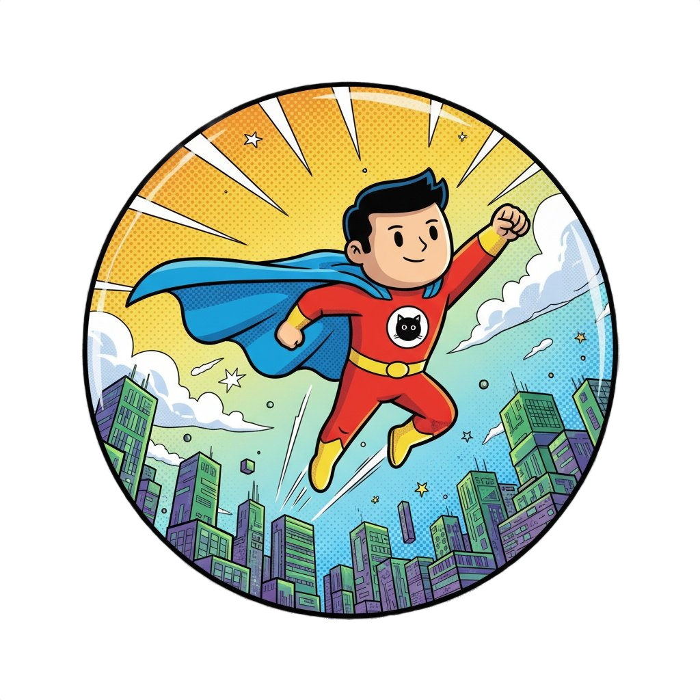

# GitSince

<p align="center">
  
</p>


GitSince is an open-source service that generates dynamic, personalized SVG badges showing how long you've been on GitHub. Just add a badge link to your README and it updates automatically!


## Features
- Fetches your GitHub join date via the GitHub API
- Renders a customizable SVG badge (e.g., "On GitHub since 2017" or "8 Years of Code 🧑‍💻")
- Multiple themes and styles
- Deployable to Vercel, Cloudflare, or GitHub Pages
- Customization via URL parameters

## Usage
Paste the badge URL in your README:

```

```

```

```

| Parameter       | Type                                         | Default               | Description                                                        |
| --------------- | -------------------------------------------- | --------------------- | ------------------------------------------------------------------ |
| `label`         | `string`                                     | Title based on years  | Main text displayed on the badge.                                  |
| `message`       | `string`                                     | `"X Year(s) of Code"` | Secondary message on the badge.                                    |
| `theme`         | `'light'` or `'dark'`                        | `'light'`             | Sets background and text colors.                                   |
| `style`         | `'flat'`, `'rounded'`, `'gradient'`          | `'flat'`              | Controls badge shape and design style.                             |
| `size`          | `'small'`, `'medium'`, `'large'`, `'custom'` | `'medium'`            | Preset badge size; determines width/height unless `custom`.        |
| `width`         | `number`                                     | Depends on `size`     | Width of the badge in pixels; used only if `size` is `'custom'`.   |
| `height`        | `number`                                     | Depends on `size`     | Height of the badge in pixels; used only if `size` is `'custom'`.  |
| `imagePosition` | `'left'` or `'right'`                        | `'left'`              | Position of the embedded badge image.                              |
| `embedImg`      | `true` or `false`                            | `true`                | Embed badge PNG as base64 (recommended for serverless deployment). |
| `fontSize`      | `number`                                     | `16`                  | Font size of the main label; message font is slightly smaller.     |


## Development
- Node.js + TypeScript
- Express server (or serverless)
- SVG rendering


## Roadmap
- Achievement badges for milestones (e.g., 100 repos)
- More themes and icons

